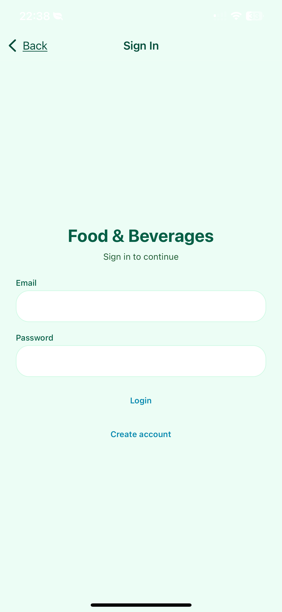
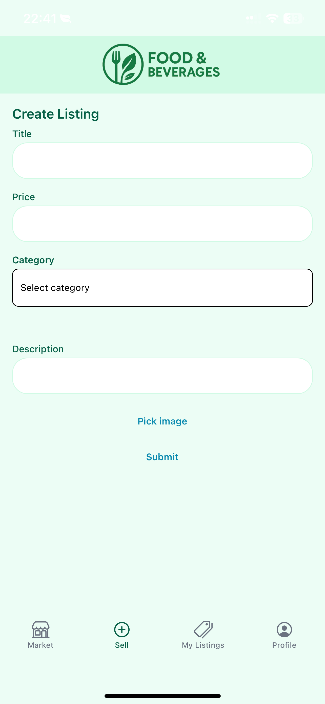
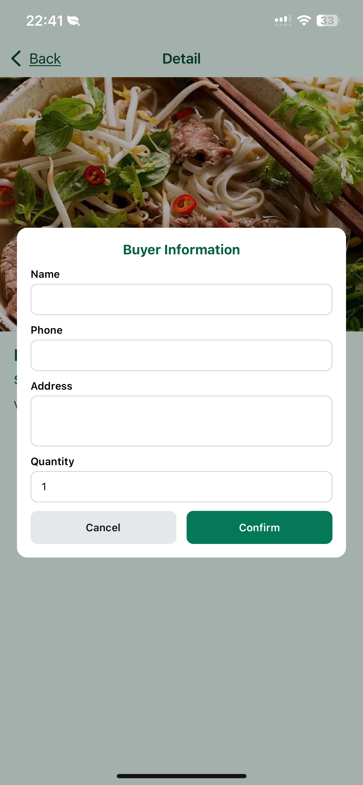
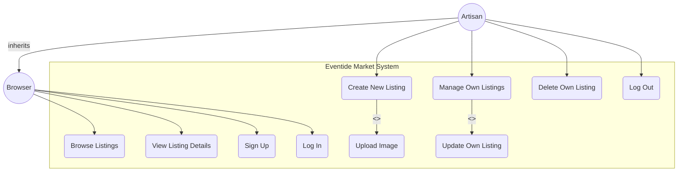

# Eventide Market

A full-stack mobile marketplace where artisans can showcase their handmade products and users can browse, view details, and interact with listings.  
Built with **Expo Router + React Native** for the frontend and **Supabase** for authentication, database, and storage.  

---

## 📌 Project Overview

**Eventide Market** allows two roles:  
- **Browser**: Any user can browse listings, view product details.  
- **Artisan**: Authenticated users who can create, manage, edit, and delete their own listings.  

The app supports image uploads, responsive UI, and smooth list navigation (infinite scroll, pull-to-refresh).  

This project was developed as a **Capstone Project** and demonstrates a complete end-to-end marketplace application.  

---

## 🚀 Features

### Core
- **Authentication** with Supabase Auth (Sign Up, Login, Logout).  
- **Protected Routes** with Context provider (only authenticated users can manage listings).  
- **Create/Edit/Delete Listings** with images uploaded to Supabase Storage.  
- **Browse Listings** with pagination, infinite scroll, and pull-to-refresh.  
- **Listing Detail Screen** with seller and item information.  

### Extensions (Beyond Baseline)
- **Edit Listing** (Update functionality with image replacement).  
- **Image Management**: Deletes associated image in Storage when a listing is deleted.  
- **Purchase Modal & Guest Orders**: Buyers can place an order, sellers can view guest orders.  
- **Custom Hooks** (`useListings`, `useImagePicker`, `useStorageUpload`) for clean and reusable logic.  

---

## 🛠️ Tech Stack

- **Frontend:** React Native (Expo Router), TypeScript  
- **Backend:** Supabase (Auth, Postgres DB, Storage)  
- **State Management:** React Context API  
- **Device APIs:** Expo Image Picker (photo library access)  

---

## 📂 Project Structure

```
app/
 ├─ (auth)/          # Auth screens (login, signup)
 ├─ (tabs)/          # Main tab navigation
 │   ├─ index.tsx    # Feed (browse listings)
 │   ├─ sell.tsx     # Create new listing
 │   ├─ my.tsx       # Manage user’s listings
 │   └─ profile.tsx  # User profile + guest orders
 ├─ edit-listing.tsx # Edit existing listing
 ├─ listing-detail.tsx # Listing detail + buy modal
 └─ listing/[id].tsx # Alternative route for listing detail
context/
 └─ AuthContext.tsx  # Authentication state management
hooks/
 ├─ useListings.ts   # Data fetching & pagination
 ├─ useImagePicker.ts # Select image from device
 └─ useStorageUpload.ts # Upload image to Supabase Storage
lib/
 └─ supabase.ts      # Supabase client configuration
components/
 ├─ Card.tsx         # Reusable UI card for listings
 ├─ PrimaryButton.tsx # Custom button
 └─ FormField.tsx    # Input field component
```

---

## ⚙️ Setup & Installation

1. **Clone this repository**  
   ```bash
   git clone https://github.com/Ber-489/Market.git
   cd market
   ```

2. **Install dependencies**  
   ```bash
   npm install
   ```

3. **Environment Variables**  
   Create a `.env` file (based on `.env.example`) with your Supabase credentials:  
   ```
   EXPO_PUBLIC_SUPABASE_URL=your-project-url
   EXPO_PUBLIC_SUPABASE_ANON_KEY=your-anon-key
   ```

4. **Run the app**  
   ```bash
   npx expo start
   ```

---

## 🔐 Supabase Setup

1. **Database Tables**
   - `listings` → `id, title, price, image_url, user_id, created_at, description, category`  
   - `profiles` → `id, display_name, created_at`  
   - `guest_orders` → `id, listing_id, seller_id, created_at, name, phone, address, quantity`  

2. **RLS Policies**
   - Listings can only be inserted/updated/deleted by the owner (`auth.uid() = user_id`).  
   - Profiles: users can only view/update their own profile.  
   - Guest Orders: sellers can only view orders for their listings.  

3. **Storage**
   - Bucket for listing images (configured in `lib/supabase.ts`).  
   - Images are uploaded when creating/editing a listing.  

---

## 📱 Demo Flow

1. **Sign up/Login** → new account created in Supabase Auth.  
2. **Browse Market Feed** → see all listings with infinite scroll.  
3. **Create Listing** → select image, upload, and save listing.  
4. **Edit Listing** → change info/image of owned listings.  
5. **Delete Listing** → remove from DB and Storage.  
6. **Buy Item (Guest Order)** → modal to submit order, visible to seller in Profile.  

---

## 📸 Screenshots (Demo UI)

- **Login & Signup**  
  

- **Market Feed (Browse Listings)**  
  

- **Create New Listing**  
  

- **My Listings (Manage, Edit, Delete)**  
  

- **Listing Detail & Buy Modal**  
  


---

## 🧩 Use Case Diagram

From the **capstone.md** specification:  



---

## ✨ Future Improvements

- Public profile screen for each seller (view all their listings).  
- Favorites system using React Context.  
- Persist session tokens for smoother login experience.  
- Enhanced validation and error handling.  
- Better bucket consistency (single config variable).  
